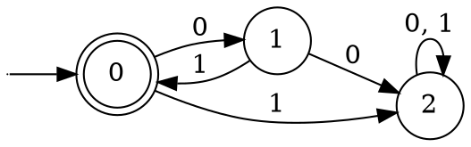

The function $\Phi_{(01)^*}$ has the following DFA:

This DFA can be defined using Sipser's definition as such:

$$
\begin{aligned}
Q &= \{0, 1, 2\} \\[0.5em]
\Sigma &= \{0, 1\} \\[0.5em]
\delta(0, 0) &= 1 \\
\delta(0, 1) &= 2 \\
\delta(1, 0) &= 2 \\
\delta(1, 1) &= 0 \\
\delta(2, 0) &= 2 \\
\delta(2, 1) &= 2 \\[0.5em]
q &= 0 \\[0.5em]
F &= \{0\}
\end{aligned}
$$
