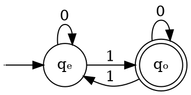

## Definition of a Deterministic Finite Automata

$$
F : \{0, 1\}^* \to \{0, 1\}
$$

$$
\begin{aligned}
F(x) &= \{ x : x \text{ has an odd number of 1s} \} \\
 L_F &= \{ 1, 111, 1101, 1011, 10101, ... \}
\end{aligned}
$$

Notations:

- $q_e$ or $0$ is the even state
- $q_o$ or $1$ is the odd state

$F(x) = 1$ if we're at the end of the input or in an accepting state

Definition (Sipser):

- $Q$ is a finite set, whose elements are called states: $Q = \{q_e, q_o\}$
- $\Sigma$ is a finite set called the _alphabet_, whose elements are called
  symbols: $\Sigma = \{0, 1\}$
- $\delta : Q \times E \to Q$ is the _transition function_:

$$
\begin{aligned}
\delta(q_e, 0) &= q_e \\
\delta(q_e, 1) &= q_o \\
\delta(q_o, 0) &= q_o \\
\delta(q_o, 1) &= q_e
\end{aligned}
$$

- $q$ is an element of $Q$ called the _start state_:

$$
q \in Q, q = q_e
$$

- $F$ is a subset of $Q$ called the _accept states_:

$$
F \leq Q, F = \{q_o\}
$$

### Alternatively

- $\Sigma = \{0, 1\}$
- $Q = [q_e, q_o]$ (this is a list, not a set; $Q$ is implicit in definition of
  $S$)
- $q$ is called $q_0$ (naught), assumed first state in list
- $S$ is the $F$ above

---

DFAs cannot compute all boolean functions $F : \{0, 1\}^* \to \{0, 1\}$.

- DFAs have restrictions
- DFAs are enumerable:
- I don't know what the last one is
