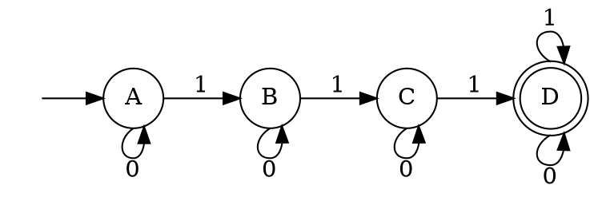

```graphviz
digraph {
	rankdir=LR;
	node [shape = circle];

	0 [label = " ", shape = none, width = 0];
	D [peripheries = 2];

	0 -> A

	A -> B [label = "1"];
	B -> C [label = "1"];
	C -> D [label = "1"];
	D:n -> D [label = "1"];

	A:s -> A [label = "0"];
	B:s -> B [label = "0"];
	C:s -> C [label = "0"];
	D:s -> D [label = "0"];
}
```
