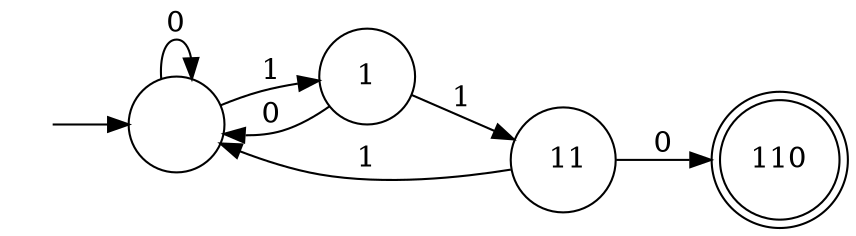

```dot
digraph {
    rankdir = LR;
    node [shape=circle];

    0   [label=" " shape=none width=0];
    ""  [label="    " pos="0,0!"]
    1   [label=" 1 " pos="1,0!"]
    11  [label=" 11" pos="2,0!"]
    110 [label="110" pos="3,0!" peripheries=2]

    0  -> ""
    "" -> 1    [label="1"]
    "" -> ""   [label="0"]
    1  -> 11   [label="1"]
    1  -> ""   [label="0"]
    11 -> 110  [label="0"]
    11 -> ""   [label="1"]
}
```
