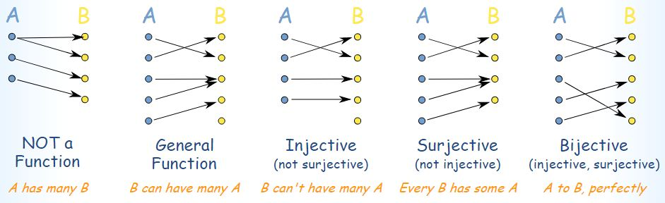

# Wednesday 02/01 - Notes

#### Author: Justin

## Representing Objects

Define functions that take some input and produce some output

Goal: Represent _(Big Idea about Ch. 2)_ any object `x` as $E(x) \in {0, 1}^*$ such that $E: domain \rightarrow {0, 1}^*$

$E$ should be [one-to-one](https://en.wikipedia.org/wiki/One-to-one) (injective).

e.g $E(x) = E(y) \  \text{only if}\ x = y$

Easy Start: Natural Numbers
$E: \mathbb(N) \rightarrow {0, 1}^*$

- Could use binary `0101` = 5
  - One's Complement
  - Two's Complement
  - Unary notation (string of zeroes) (can't be one-to-one)

Can make binary one-to-one using fixed bit width

Advantage of being Prefix-Free is unambiguity

Approaches to Prefix-Free

1. Delimit (null-termination in C strings)
2. Fixed-width encoding

_Note: performance not a consideration (theory only) some representation even if not efficient_

The Encoding function $E(x)$ must be one-to-one

Decoding functions may be partial (not all inputs have an output)

$D: {0, 1}^* \rightarrow x$

- $\mathbb{N}$ : Natural Number ${0, 1, 2, ...}$
- $\mathbb{Z}$ : Integers ${-4, -3, ..., 0, 1, 2}$
- $\mathbb{Q}$ : Rational ${-17/3, -166/19, etc...}$
- $\mathbb{R}$ : Reals
- $\mathbb{C}$ : Complex Number

## n-tuples:

not prefix free: $001 0001 00001$

soln: make separator, encode the separator in binary

define alphabet $\Sigma$ which is the set of symbols used by encoding
