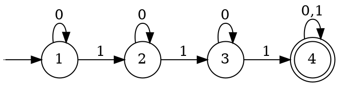

# CPSC 439 Project #2
## Task #1

#### Regular language:
$\{w:w\text{ contains at least three 1s}\}\textbf{ } \Sigma = \{0, 1\}^*.$

DFA:

#### Irregular Language:

$\\{w:  w \text{ is a palindrome}\\}$ over the alphabet $\Sigma = \{a, b\}^*$

*See:* *[Our Proof of Irregularity](https://github.com/diamondburned/cpsc-439/blob/main/yao/proj1/task5.md) via the Pumping Lemma*
