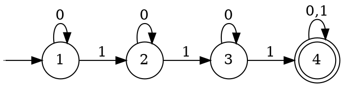

$$\{w:w\text{ contains at least three 1s}\}.$$

### DFA Diagram

### Sipser's Definition

$$M=({\left\lbrace 1,2,3,4\right\rbrace},\left\lbrace0,1\right\rbrace,\delta,1,\left\lbrace 4\right\rbrace)\text{, where }\delta\text{ is defined as:}$$

$$
\begin{array}{c|c c}
\delta & 0 & 1 \\
\hline
1 & 1 & 2\\
2 & 2 & 3\\
3 & 3 & 4\\
4 & 4 & 4\\
\end{array}
$$
